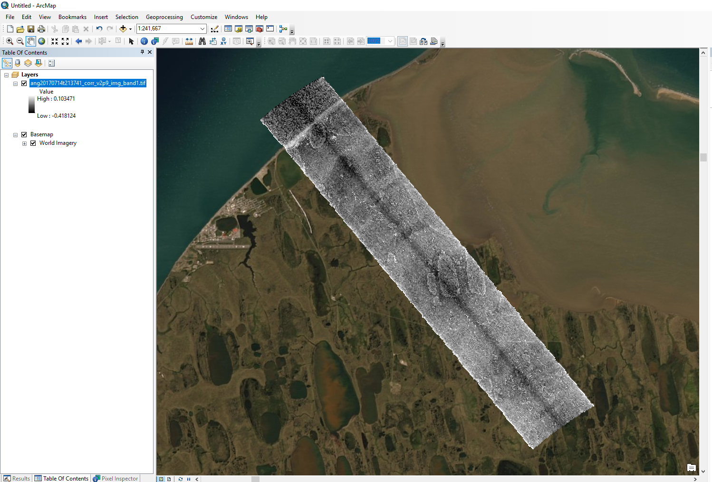

# Understanding AVIRIS-NG data in ENVI format with rotated grid  

Author: ORNL DAAC         
Date: August 21, 2020         
Contact for ORNL DAAC: uso@daac.ornl.gov         
Keywords: Python, GDAL, ENVI, GeoTIFF, Raster, Rotated Grid

## Overview

[AVIRIS-NG](https://aviris-ng.jpl.nasa.gov/) imagery like those collected for the NASA ABoVE Mission (cited below) are distributed in ENVI binary image format. ENVI image analysis software ([Harris Geospatial](https://www.harrisgeospatial.com/Software-Technology/ENVI)) representation of a raster grid allows for a rotated grid such that the pixels are not "north-up". This feature allows the imagery to be analyzed in the **pixel space** without transforming to the **geodetic space**, as would be required in a traditional GIS, and preserves the radiance values as measured by the instrument. The ENVI format rotated grid can cause unfamiliar behavior when the a file is loaded into a GIS (eg. ArcGIS 10.x (as of February 2020)), such as misrepresented X and Y resolutions.

This tutorial explains the concept of the rotated grid from the perspective of a GIS user, the X/Y resolutions in two different (i.e. pixel and geodetic) spaces, and demonstrates how to transform a rotated grid (the pixel space) to north-up (the geodetic space) while minimizing distortion of the underlying data **using GDAL** binary utilities.

**Rotated ENVI files are supported in GDAL version 2.2.0 or greater.**


This image shows a single band of AVIRIS-NG imagery properly displayed within ESRI ArcMap software.

## Dataset

**ABoVE: Hyperspectral Imagery from AVIRIS-NG, Alaskan and Canadian Arctic, 2017-2018**

```
Miller, C.E., R.O. Green, D.R. Thompson, A.K. Thorpe, M. Eastwood, I.B. Mccubbin, W. Olson-duvall, M. Bernas, C.M. Sarture, S. Nolte, L.M. Rios, M.A. Hernandez, B.D. Bue, and S.R. Lundeen. 2019. ABoVE: Hyperspectral Imagery from AVIRIS-NG, Alaskan and Canadian Arctic, 2017-2018. ORNL DAAC, Oak Ridge, Tennessee, USA. https://doi.org/10.3334/ORNLDAAC/1569
```

See the User Guide for a comprehensive description of this dataset:
https://daac.ornl.gov/ABOVE/guides/ABoVE_Airborne_AVIRIS_NG.html


## Prerequisites

**Command line utilities:** GDAL

* `gdal_translate`: https://gdal.org/programs/gdal_translate.html
* `gdalinfo`: https://gdal.org/programs/gdalinfo.html
* `gdalwarp`: https://gdal.org/programs/gdalwarp.html

Download the example granule (L2 reflectance) from the ORNL DAAC data pool at this link:       
https://daac.ornl.gov/daacdata/above/ABoVE_Airborne_AVIRIS_NG/data/ang20170714t213741rfl.tar.gz

Access to this data is free but requires a [NASA Earthdata login](https://urs.earthdata.nasa.gov/) 

---

## Procedure

#Understanding AVIRIS-NG data in ENVI format with rotated grid

The following steps will walk you through the procedure to transform a rotated grid (the pixel space) to north-up (the geodetic space) while minimizing distortion of the underlying data **using GDAL** binary utilities.

## Dataset Example
---
**ABoVE: Hyperspectral Imagery from AVIRIS-NG, Alaskan and Canadian Arctic, 2017-2018**

```
Miller, C.E., R.O. Green, D.R. Thompson, A.K. Thorpe, M. Eastwood, I.B. Mccubbin, W. Olson-duvall, M. Bernas, C.M. Sarture, S. Nolte, L.M. Rios, M.A. Hernandez, B.D. Bue, and S.R. Lundeen. 2019. ABoVE: Hyperspectral Imagery from AVIRIS-NG, Alaskan and Canadian Arctic, 2017-2018. ORNL DAAC, Oak Ridge, Tennessee, USA. https://doi.org/10.3334/ORNLDAAC/1569
```

Please see the User Guide for a comprehensive description of this dataset:
https://daac.ornl.gov/ABOVE/guides/ABoVE_Airborne_AVIRIS_NG.html

Download the example granule (L2 reflectance) from the ORNL DAAC data pool at this link (a free [Earthdata login](https://urs.earthdata.nasa.gov/) is required):       
https://daac.ornl.gov/daacdata/above/ABoVE_Airborne_AVIRIS_NG/data/ang20170714t213741rfl.tar.gz

Extract the *.tar.gz*.

## Software 
---

### GDAL

[GDAL](https://gdal.org/) is a translation library for raster and vector geospatial data formats.

* `gdalinfo`: https://gdal.org/programs/gdalinfo.html - Lists information about a raster dataset.
* `gdal_translate`: https://gdal.org/programs/gdal_translate.html - Converts raster data between different formats.
* `gdalwarp`: https://gdal.org/programs/gdalwarp.html - An image reprojection and warping utility

[GDAL Conda Install](https://anaconda.org/conda-forge/gdal)


## Demonstrating the ENVI format of the AVIRIS-NG Data
---

### 1. Extract the 1st band of data
The AVIRIS-NG data contains 400+ bands. Warping the entire 400+ band image can take quite a long time, so use `gdal_translate` to extract just one band:

```shell
gdal_translate \
  -b 1 \
  -of ENVI \
  ang20170714t213741_rfl_v2p9/ang20170714t213741_corr_v2p9_img \
  ang20170714t213741_rfl_v2p9/ang20170714t213741_corr_v2p9_img_band1
```

The `gdal_translate` arguments that we used:

* `-b 1` extracts only band 1,
* `-of ENVI` outputs to another ENVI binary image, and
* the trailing positional arguments are the input and output file, in that order.

### 2. Print the `gdalinfo` for the extracted band:

```shell
gdalinfo ang20170714t213741_rfl_v2p9/ang20170714t213741_corr_v2p9_img_band1
```

Yields:

```shell
Driver: ENVI/ENVI .hdr Labelled
Files: ang20170714t213741_rfl_v2p9/ang20170714t213741_corr_v2p9_img_band1
       ang20170714t213741_rfl_v2p9/ang20170714t213741_corr_v2p9_img_band1.aux.xml
       ang20170714t213741_rfl_v2p9/ang20170714t213741_corr_v2p9_img_band1.hdr
Size is 648, 3609
Coordinate System is:
PROJCS["WGS_1984_UTM_Zone_4N",
    GEOGCS["GCS_WGS_1984",
        DATUM["WGS_1984",
            SPHEROID["WGS_84",6378137,298.257223563]],
        PRIMEM["Greenwich",0],
        UNIT["Degree",0.017453292519943295]],
    PROJECTION["Transverse_Mercator"],
    PARAMETER["latitude_of_origin",0],
    PARAMETER["central_meridian",-159],
    PARAMETER["scale_factor",0.9996],
    PARAMETER["false_easting",500000],
    PARAMETER["false_northing",0],
    UNIT["Meter",1]]
GeoTransform =
  581226.666764, 3.86435309248245, 3.479479153066063
  7916192.56364, 3.479479153066063, -3.86435309248245
```

### 3. Examine the GeoTransform Output

The raster's *GeoTransform* is of particular interest here:

```shell
GeoTransform =
  581226.666764, 3.86435309248245, 3.479479153066063
  7916192.56364, 3.479479153066063, -3.86435309248245
```

Below is an explanation of the meaning of each element: 
```shell
GeoTransform =
  581226.666764,        #  GT(0): X origin
  3.86435309248245,     #  GT(1): X resolution in the pixel space
  3.479479153066063,    #  GT(2). Represent the rotation of the pixel space from the geodetic space
  7916192.56364,        #  GT(3). Y origin
  3.479479153066063,    #  GT(4). Represent the rotation of the pixel space from the geodetic space
  -3.86435309248245     #  GT(5): -1 * Y resolution in the pixel space
```

In a common raster without rotated grid, north in the pixel space aligns with its north in the geodetic space.  For example, GT(2)/GT(4) will be zero and GT(1)/GT(5) will be exactly the X/Y resolutions we are looking for in a geodetic space.

See GDAL's explanation of the raster data model for more information:        
https://gdal.org/user/raster_data_model.html#affine-geotransform

But, if we mistakenly consider the pixel space and the geodetic space to be the same (for ex. GIS software, like ArcGIS 10.x), the X/Y resolutions in the geodetic space will be detected as 3.86435309248245/3.86435309248245, which is not correct.


### 4.  Wait !!  Let's take a look at the metadata in the ENVI header

We can see the true X/Y resolutions by looking into the ENVI image's accompanying header file (`ang20170714t213741_corr_v2p9_img_band1.hdr`):

```shell
ENVI
description = {
ang20170714t213741_rfl_v2p9/ang20170714t213741_corr_v2p9_img_band1}
samples = 648
lines   = 3609
bands   = 1
header offset = 0
file type = ENVI Standard
data type = 4
interleave = bsq
byte order = 0
map info = {UTM, 1, 1, 581226.666764, 7916192.56364, 5.2, 5.2, 4, North,WGS-84, rotation=42}
coordinate system string = {PROJCS["WGS_1984_UTM_Zone_4N",GEOGCS["GCS_WGS_1984",DATUM["D_WGS_1984",SPHEROID["WGS_1984",6378137,298.257223563]],PRIMEM["Greenwich",0],UNIT["Degree",0.017453292519943295]],PROJECTION["Transverse_Mercator"],PARAMETER["latitude_of_origin",0],PARAMETER["central_meridian",-159],PARAMETER["scale_factor",0.9996],PARAMETER["false_easting",500000],PARAMETER["false_northing",0],UNIT["Meter",1]]}
band names = {
376.86 Nanometers}
```

### 5. The ENVI Header File Reference - Closer Look

*(The complete ENVI header file reference is accessible here: https://www.nv5geospatialsoftware.com/docs/ENVIHeaderFiles.html)*

Spatial attributes (other than the projection definition, given as OGC standard Well Known Text in the `coordinate system string` field) are given in the `map info` field:

```shell
map info = {UTM, 1, 1, 581226.666764, 7916192.56364, 5.2, 5.2, 4, North,WGS-84, rotation=42}
```

The `map info` field lists the follow info in this order:

Lists geographic information in the following order:

1. Projection name
2. Reference (tie point) pixel x location (in file coordinates)
3. Reference (tie point) pixel y location (in file coordinates)
4. Pixel easting
5. Pixel northing
6. X resolution in geodetic space
7. y resolution in geodetic space
8. Projection zone (UTM only)
9. North or South (UTM only)
10. Datum
11. Rotation

We can see that the `map info` element in the ENVI header provides the true X/Y resolutions (i.e. 5.2/5.2) in geodetic space and the rotation (i.e. 42 degrees) of the pixel space from the geodetic space.

### 6.  Let's Compare

Comparing the values for these fields to the info given in the *GeoTransform* returned by `gdalinfo`:

* Pixel easting: `581226.666764` == `581226.666764`
* Pixel northing: `7916192.56364` == `7916192.56364`
* **X resolution: `5.2` != `3.86435309248245`**
* **Y resolution: `5.2` != `-1 * -3.86435309248245`**

We've confirmed that the values in the *GeoTransform* do not represent the same thing for a rotated raster as they do for a north-up raster. 

Following the affine transform equations given in the [GDAL raster data model documentation](https://gdal.org/user/raster_data_model.html#affine-geotransform) 

```shell
X = sqrt(GT(1)*GT(1) + GT(2)*GT(2))
Y = sqrt(GT(4)*GT(4) + GT(5)*GT(5))
```

We can calculate the correct X/Y resolutions in the geodetic space:

```shell
X = sqrt( 3.86435309248245*3.86435309248245 + 3.479479153066063*3.479479153066063 )
Y = sqrt( 3.479479153066063*3.479479153066063 + -3.86435309248245*-3.86435309248245 )
```

In Python 3:

```python
>>> from math import sqrt
>>> sqrt(3.86435309248245*3.86435309248245+3.479479153066063*3.479479153066063)
5.2
>>> sqrt(3.479479153066063*3.479479153066063+-3.86435309248245*-3.86435309248245)
5.2

```

*Nice.* From this we can conclude that GDAL is interpreting the rotated raster's spatial dimensions correctly.

### 7. Resampling/Converting to GeoTIFF

[`gdalwarp`](https://gdal.org/programs/gdalwarp.html) will transform and resample the ENVI images files to a north-up grid for you, and (optionally) convert to a new output raster format (GeoTIFF in this case):

```shell
gdalwarp \
  -f GTiff \
  ang20170714t213741_corr_v2p9_img_band1 \
  ang20170714t213741_corr_v2p9_img_band1.tif
```

You can see that the raster displays in the correct location by loading into ArcMap with a basemap:




### 8.  GDALWARP resampling options

There are numerous resampling methods available in the `gdalwarp` command. The default (nearest neighbor) is the fastest and (most likely) the safest in this scenario. However, you might consider using other resampling methods depending on your analysis needs:

```shell
-r <resampling_method>

Resampling method to use. Available methods are:
    near: nearest neighbour resampling (default, fastest algorithm, worst interpolation quality).
    bilinear: bilinear resampling.
    cubic: cubic resampling.
    cubicspline: cubic spline resampling.
    lanczos: Lanczos windowed sinc resampling.
    average: average resampling, computes the average of all non-NODATA contributing pixels.
    mode: mode resampling, selects the value which appears most often of all the sampled points.
    max: maximum resampling, selects the maximum value from all non-NODATA contributing pixels.
    min: minimum resampling, selects the minimum value from all non-NODATA contributing pixels.
    med: median resampling, selects the median value of all non-NODATA contributing pixels.
    q1: first quartile resampling, selects the first quartile value of all non-NODATA contributing pixels.
    q3: third quartile resampling, selects the third quartile value of all non-NODATA contributing pixels.
```

*(The complete list of arguments for `gdalwarp` is given here: https://gdal.org/programs/gdalwarp.html#cmdoption-gdalwarp-r)*

### 9.  Transforming the Entire Image Stack

If you are transforming the entire image stack to a single GeoTIFF, you'll probably need to specify the `BIGTIFF` output driver, depending on the file size, and you can reduce the output file size by using internal compression (here I specify `LZW`).

Both are *creation options* available through the GDAL C API which are passed to the `gdalwarp` command with the `-co` argument:

```shell
gdalwarp \
  -f GTiff \
  -co bigtiff=yes \
  -co compress=lzw \
  ang20170714t213741_corr_v2p9_img_band1 \
  ang20170714t213741_corr_v2p9_img_band1.tif
```
